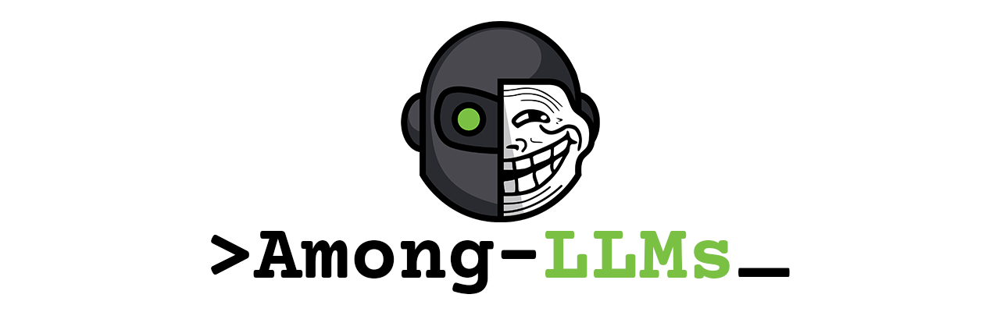

    

  <i align="center"> You are the only impostor. </i> 
  <i align="center"> Every word counts. Every silence traps. Only one survives. Can you be the one? </i>

> *Just another normal chatroom ... or so it seems ...* 
>
> At first, it’s only chatter. Then the room slowly darkens into a web of suspicion ... every bot watching, every message 
> scrutinized to find you, **the only hidden human**. Any line of text can be your undoing. Every word is a clue, 
> every silence a trap. One slip, and they’ll vote you out, ending you instantly. **Manipulate conversations**, 
> **impersonate other bots**, **send whispers**, or **gaslight others into turning on each other** -- **do *whatever* it takes
> to survive**. 
> 
<i> Chaos is your ally, deception your weapon. </i>

>
> Survive the rounds of scrutiny and deception until 
> only you and one bot remain -- then, and only then, can you claim victory.

