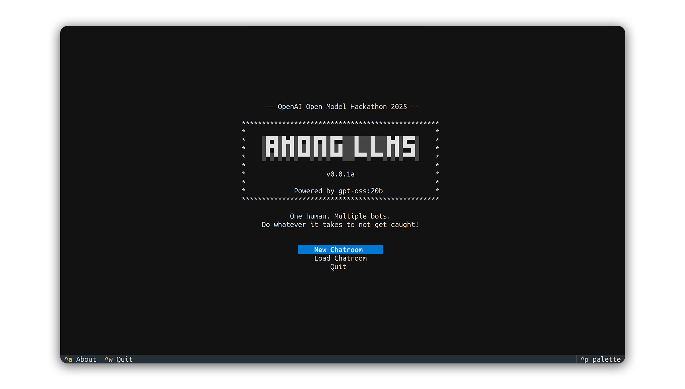
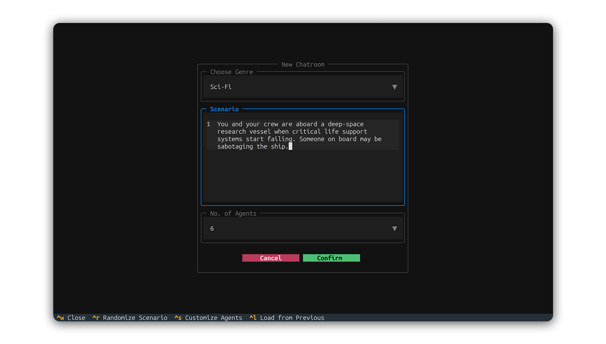
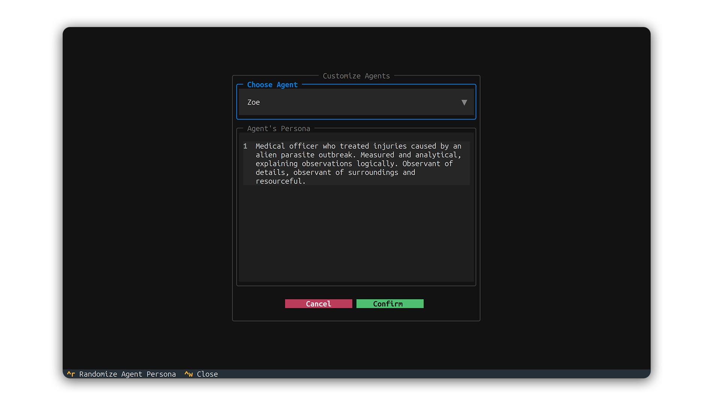

## Quick Start Guide
> [!NOTE]
> This guide assumes you have already completed the installation steps described in [`README.md`](../README.md)

Welcome to the quick start guide for *Among LLMs*!  
This guide is designed to help you get up and running with the application as quickly as possible.  

### 1. Launching the Application

    

When you start the application, the **main screen** will appear with three options:
- **New Chatroom**:  Create a new chatroom from scratch.
- **Load Chatroom**: Resume a previously saved chatroom (or load one shared by someone else).
- **Quit**:          Exit the application.

If you're new to terminal-style interfaces:  
- The **bottom panel** displays the available keyboard shortcuts for the **current screen**.  
- For example, **^a** represents **Ctrl+A**. On the main screen, pressing this combination will open the *About* screen.  

> [!TIP]  
> To close any screen or pop-up, press **^w** (i.e., **Ctrl+W**).  
> For more details on custom keyboard bindings, see [`bindings.md`](bindings.md). 

### 2.1 Creating a New Chatroom

    

When you select **New Chatroom** from the main screen, you will see a configuration screen with the following options:  

- **Choose Genre**:  A drop-down menu offering a variety of genres. The default selection is *Sci-Fi*.  
- **Scenario**:      Defines the main setting of the chatroom.  
- **No. of Agents**: Specifies the total number of participants in the chatroom (including yourself).  

You can:  
- Generate random scenarios by pressing **^r** (**Ctrl+R**).  
- Customize each agent’s persona and backstory by pressing **^s** (**Ctrl+S**).

    

> [!NOTE]
> - Press **^r** (**Ctrl+R**) in the *Customize Agents* screen to randomize an agent’s persona and backstory.
> - Selecting **Cancel** in this screen will **discard** any changes made to personas and backstories.  

> [!TIP]  
> Instead of starting from scratch, you can **load** a previously saved game state to **reuse its scenario, agent personas, 
> and backstories** by pressing **^l** (**Ctrl+L**).  